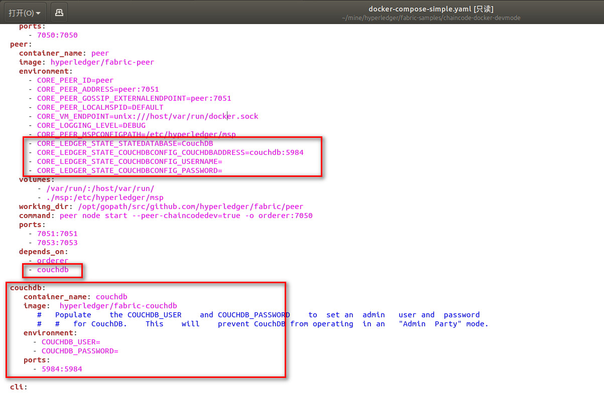

### 自己实现弹珠项目

```go
package main

import (
	"github.com/hyperledger/fabric/core/chaincode/shim"
	"github.com/hyperledger/fabric/protos/peer"
	"fmt"
	"strconv"
	"encoding/json"
	"bytes"
	"time"
)

type  MyMarblesChaincode struct {


}

type marble struct {
	ObjectType  string `json:"objectType"`
	Name string `json:"name"`
	Color string `json:"color"`
	Size int `json:"size"`
	Owner string `json:"owner"`
}

func (t *MyMarblesChaincode)Init(stub shim.ChaincodeStubInterface) peer.Response  {


	return shim.Success(nil	)
}

func (t *MyMarblesChaincode)Invoke( stub shim.ChaincodeStubInterface) peer.Response  {

	fn, args := stub.GetFunctionAndParameters()
	if fn == "initMarble"{
		return t.initMarble(stub, args)
	}else if fn == "readMarble"{
		return t.readMarble(stub, args)
	}else if fn == "deleteMarble"{
		return t.deleteMarble(stub, args)
	}else if fn == "transferMarble"{
		return t.transferMarble(stub, args)
	}else if fn == "getMarblesByRange"{
		return t.getMarblesByRange(stub, args)
	}else if fn == "queryMarblesByOwner"{
		return t.queryMarblesByOwner(stub, args)
	}else if fn == "getHistoryForMarble"{
	   return t.getHistoryForMarble(stub, args)
	}

	return shim.Success(nil)
}

func (t *MyMarblesChaincode)initMarble( stub shim.ChaincodeStubInterface,  args  []string) peer.Response {

	marbleName := args[0]

	//判断marble是否已经存在
	marbleBytes , err := stub.GetState(marbleName)
	if err != nil{
		return shim.Error(err.Error())
	}
	if marbleBytes != nil{
		return shim.Error("marble 已经存在")
	}

	color := args[1]
	size , err := strconv.Atoi(args[2])
	if err != nil{
		return shim.Error(err.Error())
	}

	owner := args[3]
	objectType := "marble"  //???

	marbleObj  := &marble{ObjectType:objectType, Name:marbleName, Color:color, Size:size, Owner:owner}

	marbleJSONAsBytes , err := json.Marshal(marbleObj)
	if err != nil{
		return shim.Error(err.Error())
	}

	err = stub.PutState(marbleName, marbleJSONAsBytes)
	if err != nil {
		return shim.Error(err.Error())
	}

	return shim.Success(nil)
}


func (t *MyMarblesChaincode)readMarble( stub shim.ChaincodeStubInterface,  args  []string) peer.Response {


	marbleName := args[0]
	marbleAsBytes , err := stub.GetState(marbleName)
	if err != nil{
		return shim.Error(err.Error())
	}
	if marbleAsBytes == nil{
		return shim.Error("不存在")
	}

	return shim.Success(marbleAsBytes)
}

func (t *MyMarblesChaincode)deleteMarble( stub shim.ChaincodeStubInterface, args []string) peer.Response  {

	marbleName := args[0]

	marbleAsBytes , err := stub.GetState(marbleName)
	if err != nil{
		return shim.Error(err.Error())
	}
	if marbleAsBytes == nil{
		return shim.Error("所要删除的marble不存在")
	}

	err = stub.DelState(marbleName)
	if err != nil{
		return shim.Error(err.Error())
	}

	return shim.Success(nil)
}

//转移弹珠
func (t *MyMarblesChaincode)transferMarble(stub shim.ChaincodeStubInterface, args []string) peer.Response {

	marbleName := args[0]
	newOwner := args[1]


	//判断marble是否存在
	marbleAsBytes , err := stub.GetState(marbleName)
	if err != nil{
		return shim.Error(err.Error())
	}else if marbleAsBytes == nil{
		return shim.Error("marble不存在")
	}

	marbleObj := marble{}
	err = json.Unmarshal(marbleAsBytes, &marbleObj)
	if err != nil{
		return  shim.Error(err.Error())
	}

	marbleObj.Owner = newOwner
	newMarbleAsBytes, err := json.Marshal(marbleObj)
	if err != nil{
		return shim.Error(err.Error())
	}else if newMarbleAsBytes == nil{
		return shim.Error("marble --> json 转换错误")
	}

	//更新
	err = stub.PutState(marbleName, newMarbleAsBytes)
	if err != nil{
		return  shim.Error(err.Error())
	}

	return shim.Success(nil)
}

//根据key, 获取一定范围内的弹珠
func (t *MyMarblesChaincode)getMarblesByRange(stub shim.ChaincodeStubInterface, args []string) peer.Response {

	startKey := args[0]
	endKey := args[1]


	resultInterator  , err :=  stub.GetStateByRange(startKey, endKey)
	if err != nil{
		return shim.Error(err.Error())
	}
	defer resultInterator.Close()


	//组装json格式
	var buffer bytes.Buffer
	buffer.WriteString("[")

	isFirst := true
	for resultInterator.HasNext(){
		queryResponse , err := resultInterator.Next()
		if err != nil{
			return shim.Error(err.Error())
		}

		if isFirst == false{
			buffer.WriteString(",")
		}

		buffer.WriteString(`{"key": `)
		buffer.WriteString(queryResponse.Key)


		buffer.WriteString(`,"record" : `)
		buffer.WriteString(string(queryResponse.Value))
		buffer.WriteString("}")


		isFirst = true
	}

	buffer.WriteString("]")

	return shim.Success(buffer.Bytes())
}


//查询制定拥有者拥有的marble, 会用到富查询需要配置CouchDB.
func (t *MyMarblesChaincode)queryMarblesByOwner(stub  shim.ChaincodeStubInterface, args []string)  peer.Response{

	owner := args[0]
	queryStr := fmt.Sprintf(`{"selector" : {"owner" : "%s"}}`, owner)


	resultIterator , err := stub.GetQueryResult(queryStr)
	if err != nil{
		return shim.Error(err.Error())
	}
	defer resultIterator.Close()

	//组装json格式
	var buffer bytes.Buffer
	buffer.WriteString("[")

	isFirst := true
	for resultIterator.HasNext(){
		queryResponse , err := resultIterator.Next()
		if err != nil{
			return shim.Error(err.Error())
		}

		if isFirst == false{
			buffer.WriteString(",")
		}

		buffer.WriteString(`{"key": `)
		buffer.WriteString(queryResponse.Key)


		buffer.WriteString(`,"record" : `)
		buffer.WriteString(string(queryResponse.Value))
		buffer.WriteString("}")


		isFirst = true
	}

	buffer.WriteString("]")

	return shim.Success(buffer.Bytes())
}

//查询一个marble的历史信息
func (t *MyMarblesChaincode)getHistoryForMarble(stub  shim.ChaincodeStubInterface, args []string) peer.Response{

	marbleName := args[0]
	resultIterator , err := stub.GetHistoryForKey(marbleName)
	if err != nil{
		return shim.Error(err.Error())
	}
	defer resultIterator.Close()


	//组装json格式
	var buffer bytes.Buffer
	buffer.WriteString("[")

	isFirst := true
	for resultIterator.HasNext(){
		queryResponse , err := resultIterator.Next()
		if err != nil{
			return shim.Error(err.Error())
		}

		if isFirst == false{
			buffer.WriteString(",")
		}

		buffer.WriteString(`{"TxId": `)
		buffer.WriteString(queryResponse.TxId)


		buffer.WriteString(`,"Timestamp" : `)
		buffer.WriteString(time.Unix(queryResponse.Timestamp.Seconds, int64(queryResponse.Timestamp.Nanos)).String())


		buffer.WriteString(`,"Value": `)
		buffer.WriteString(string(queryResponse.Value))

		buffer.WriteString(`,"IsDelete": `)
		buffer.WriteString( strconv.FormatBool(  queryResponse.IsDelete ) )

		buffer.WriteString("}")

		isFirst = true
	}

	buffer.WriteString("]")


	return shim.Success(buffer.Bytes())
}

func main()  {

	err := shim.Start(new(MyMarblesChaincode))
	if err != nil{
		fmt.Println("chaincode start error : " , err)
	}
}
```


### 部署和测试

将mymarbles目录复制到fabric-sample/chaincode目录下


- 终端1-启动网络

  ```
  
  编辑 docker-compose-simple.yaml文件如下图, 配置CouchDB, 以支持 queryMarblesByOwner的富查询
  ----------------------------------------------
  - CORE_LEDGER_STATE_STATEDATABASE=CouchDB
  - CORE_LEDGER_STATE_COUCHDBCONFIG_COUCHDBADDRESS=couchdb:5984
  - CORE_LEDGER_STATE_COUCHDBCONFIG_USERNAME=
  - CORE_LEDGER_STATE_COUCHDBCONFIG_PASSWORD=
  
  couchdb:	
    container_name:	couchdb	
    image:	hyperledger/fabric-couchdb	
    #Populate the COUCHDB_USER and COUCHDB_PASSWORD	to set an admin	user andpassword	
    #for CouchDB.This will prevent CouchDB	from operating in an "Admin Party" mode.	
    environment:	
      - COUCHDB_USER=	
      - COUCHDB_PASSWORD=	
    ports:	
      - 5984:5984
  --------------------------------------------
  ```

  

  ```
  #然后启动网络
  cd chaincode-docker-devmode
  docker-compose -f docker-compose-simple.yaml up
  ```


- 终端2-编译链码

  ```
  sudo docker exec -it chaincode bash
  
  go build
  
  CORE_PEER_ADDRESS=peer:7052 CORE_CHAINCODE_ID_NAME=mycc:0 ./mymarbles
  
  ```


- 终端3-安装并实例化链码

  ```
  
  sudo docker exec -it cli bash
  
  peer chaincode install -p chaincodedev/chaincode/mymarbles -n mycc -v 0
  
  peer chaincode instantiate -n mycc -v 0 -c '{"Args":[]}' -C myc
  
  
  peer chaincode invoke -n mycc -c '{"Args":["initMarble","marble1","blue","55","yqq"]}' -C myc
  peer chaincode invoke -n mycc -c '{"Args":["initMarble","marble2","red","11","tom"]}' -C myc
  peer chaincode invoke -n mycc -c '{"Args":["initMarble","marble3","yellow","89","yqq"]}' -C myc
  peer chaincode invoke -n mycc -c '{"Args":["initMarble","marble4","orange","35","yqq"]}' -C myc
  
  
  peer chaincode query -n mycc -c '{"Args":["readMarble","marble1"]}' -C myc
  
  peer chaincode invoke -n mycc -c '{"Args":["deleteMarble","marble1"]}' -C myc
  
  peer chaincode query -n mycc -c '{"Args":["getMarblesByRange","marble1", "marble6"]}' -C myc
  
  peer chaincode invoke -n mycc -c '{"Args":["transferMarble","marble1", "Jack"]}' -C myc
  
  peer chaincode query -n mycc -c '{"Args":["getHistoryForMarble","marble1"]}' -C myc
  
  peer chaincode query -n mycc -c '{"Args":["queryMarblesByOwner","yqq"]}' -C myc
  ```


