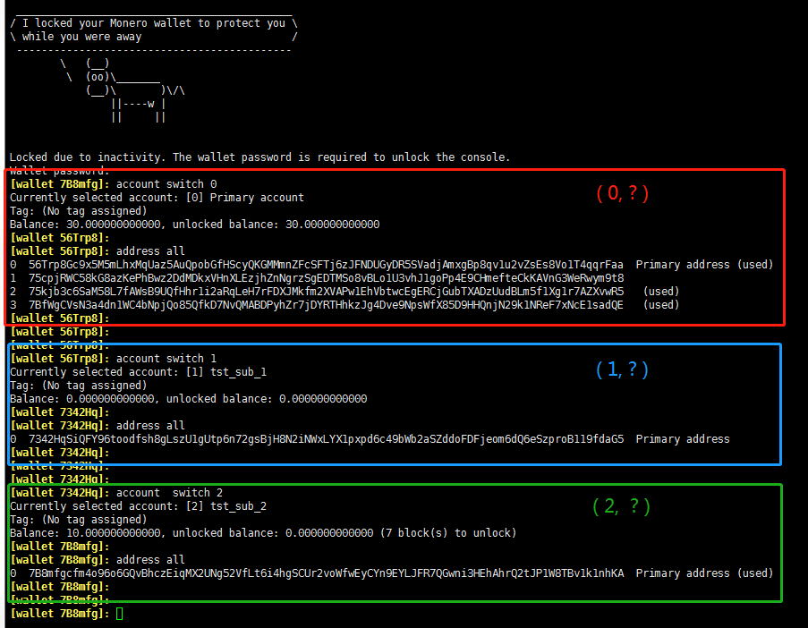

## XMR 子地址生成 Demo

```python
#!coding:utf8

#author:yqq
#date:2020/3/13 0013 10:29
#description:

from monero.address import Address, address, IntegratedAddress, SubAddress
from monero.seed import Seed
from monero.wordlists import list_wordlists
from monero.seed import const
from monero.wallet import *
from monero.account import *


def get_address(master_addr, major, minor, seed : Seed):
    """
    Calculates sub-address for account index (`major`) and address index within
    the account (`minor`).

    :rtype: :class:`BaseAddress <monero.address.BaseAddress>`
    """
    # ensure indexes are within uint32
    if major < 0 or major >= 2 ** 32:
        raise ValueError('major index {} is outside uint32 range'.format(major))
    if minor < 0 or minor >= 2 ** 32:
        raise ValueError('minor index {} is outside uint32 range'.format(minor))
    master_address = master_addr  #self.address()
    if major == minor == 0:  #如果是  (0, 0) 则直接返回
        return master_address


    priv_view_key =  seed.secret_view_key()
    master_svk = unhexlify(priv_view_key)

    pub_spend_key = seed.public_spend_key()
    master_psk = unhexlify( pub_spend_key  )

    # master_svk = unhexlify(self.view_key())
    # master_psk = unhexlify(self.address().spend_key())


    # m = Hs("SubAddr\0" || master_svk || major || minor)
    hsdata = b''.join([
        b'SubAddr\0', master_svk,
        struct.pack('<I', major), struct.pack('<I', minor)])
    m = keccak_256(hsdata).digest()
    # D = master_psk + m * B
    D = ed25519.edwards_add(
        ed25519.decodepoint(master_psk),
        ed25519.scalarmult_B(ed25519.decodeint(m)))

    # C = master_svk * D
    C = ed25519.scalarmult(D, ed25519.decodeint(master_svk))
    netbyte = bytearray([const.SUBADDR_NETBYTES[const.NETS.index(master_address.net)]])
    data = netbyte + ed25519.encodepoint(D) + ed25519.encodepoint(C)
    checksum = keccak_256(data).digest()[:4]
    return address.SubAddress(base58.encode(hexlify(data + checksum)))


def main():


    sed = 'dozen lazy lucky itinerary egotistic inbound eating deity debut knapsack sedan onslaught atrium uphill dwarf furnished ongoing rated exotic sidekick names budget lazy misery inbound'

    seed = Seed(phrase_or_hex=sed)

    primary_addr =  seed.public_address(net=const.NET_STAGE)
    print(f'primary_addr: {primary_addr}')


    print(f'(0, 0) : {get_address( primary_addr, 0, 0, seed=seed )}')
    print(f'(0, 1) : {get_address( primary_addr, 0, 1, seed=seed )}')
    print(f'(0, 2) : {get_address( primary_addr, 0, 2, seed=seed )}')
    print(f'(0, 3) : {get_address( primary_addr, 0, 3, seed=seed )}')


    print(f'(1, 0) : {get_address( primary_addr, 1, 0, seed=seed )}')
    print(f'(1, 1) : {get_address( primary_addr, 1, 1, seed=seed )}')

    print(f'(2, 0) : {get_address( primary_addr, 2, 0, seed=seed )}')

    pass


if __name__ == '__main__':

    main()


```


运行结果


和钱包中的地址对比

