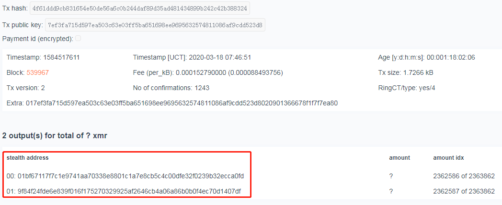
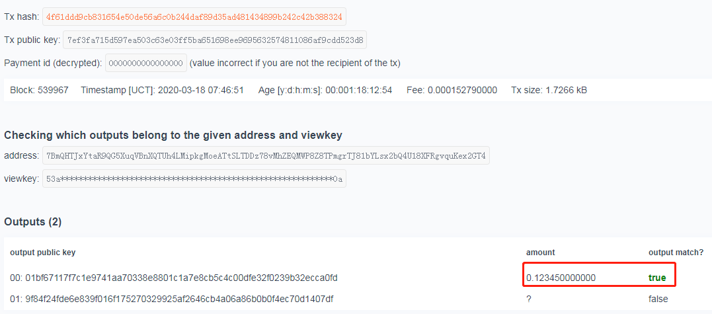

## XMR交易过程

### 参考文档

- 书: [《精通门罗币 : 私密交易的未来》(Mastering Monero) ](https://github.com/monerobook/monerobook)
- 书中的代码示例: [《精通门罗币 : 私密交易的未来》](https://github.com/monerobook/code)
- [深入探究门罗币与密码学](https://medium.com/@WooKeyWallet/精通门罗币-第5章-深入探究门罗币与密码学-下篇-3dedd99f75bf)
- [门罗币的环签名分析](https://github.com/XChainLab/documentation/blob/master/privacy/门罗币、ZEC和达世币的对比分析之二门罗币的环签名分析.md)
- 官方介绍视频
  - [1.隐匿地址 Stealth Address_Monero官方介绍视频](https://www.youtube.com/watch?v=bWst278J8NA)
  - [2.环签名 Ring Signature_Monero官方介绍视频](https://www.youtube.com/watch?v=zHN_B_H_fCs)
  - [3.环机密交易 Ring Confidential Transaction_Monero官方介绍视频](https://www.youtube.com/watch?v=M3AHp9KgTkQ)
- 官方的文档, 详细介绍Monero的数学原理: [《Zero to Monero》](https://www.getmonero.org/library/Zero-to-Monero-1-0-0.pdf)

### 名词解析

- *Dynamic Block Size* : 动态区块大小, Monero会根据链上交易的情况自动调整区块大小, 这是Monero和Bitcoin不的地方

- *Ring Signature*: 环签名,  使用签名者的TXO和其他人的"诱饵"(decoy) TXO(随机选择的)进行混合, 再用交易发送方生成的一次性私钥进行签名.  这样的签名可以花费掉那个"真实的"TXO,  矿工可以通过公钥验证签名的有效性, 但是无法知道是谁提供的私钥进行的签名, 也无从得知哪个TXO被花费了. 

  - 概念性介绍:

    https://github.com/monerobook/monerobook/blob/master/chapters/3.md#323-ring-signatures

  - 底层机制和数学原理:

    https://github.com/monerobook/monerobook/blob/master/chapters/5.md#543-ring-signatures

- *key-image* : 

  - 每笔交易输出(TXO)都有唯一的key-image, 每当一个TXO被花费了, 链上就会记录这个key-image. Monero的链上也维护了一份全局的key-image表, 这样矿工就可以判断一个TXO之前是否已经被使用过, 从而防止"双花".  
  - key-image 和 TXO  是不关联的, 即无法通过key-image确定是哪笔TXO.  在Monero网络中,无法直接确定某个TXO是否已经被花费, 只能通过key-image判断一个TXO是否已经被花费过.
  - 一个TXO可以多次作为"诱饵"(decoy) 出现在环签名中

- *RingCT  ( Ring  Confidential  Transaction)*: 环机密交易, 用于隐藏真实的转账金额. 基于Range Proof以确保所有的数是正数.  在不提供任何有效的信息的情况下可以让矿工验证输入和输出的金额是合法的, 验证者无法知道具体的交易金额是多少.

  - 概念性介绍:

    https://github.com/monerobook/monerobook/blob/master/chapters/3.md#321-ring-confidential-transaction

  - 底层机制:

    https://github.com/monerobook/monerobook/blob/master/chapters/5.md#542-ring-confidential-transactions

- Monero 地址由  Public Spend Key 和 Public View Key 组成 (当然, 还包括 1个字节的网络标志, 和 4字节的校验和 )

- *Stealth (one-time) Addresses*:  隐匿地址(一次性),  交易的发送方使用接收方的公钥(含在地址中的) 生成一次性公钥作为交易输出,  而不是直接把接收方的公钥作为交易输出

  >  https://github.com/monerobook/monerobook/blob/master/chapters/3.md#322-stealth-one-time-addresses
  
  *注意:   stealth addresses  和   subaddresses  是不同的.  subaddresses 是可以重复使用的, 并且重复使用, subaddress不会被记录在区块链上.*
  
  

### XMR交易流程图

- 1,  2, 3 , 4  :  生成 一次性私钥, 此私钥与上一笔交易输出中的One-Time Public 相关

- 5, 6, 7, 8, 9  : Bob使用Carol的Public Spend Key 和 Public View Key 生成一次性公钥 , 作为新的交易的输出, 这个输出中的公钥是在区块链上公开的, 任何人都可以看到,  例如下图的[测试交易](https://community.xmr.to/explorer/stagenet/tx/4f61ddd9cb831654e50de56a6c0b244daf89d35ad481434899b242c42b388324):

  

  使用 Private View Key 解密后可以看到输出

  

- 10  :将真实的TXO(交易输出) 与其他人的TXO进行混合

- 11  :刚生成的一次私钥对应的公钥和上一笔交易输出的隐匿输出公钥相等

- 12, 13,  14 : 使用一次性私钥进行环签名,   每笔交易的key-image是唯一的以防止双花

- 15: 将环签名附加在交易结构后面

