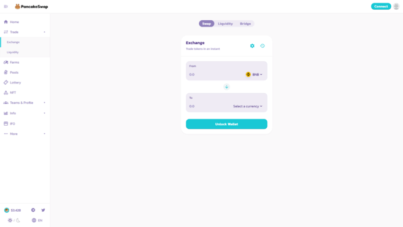
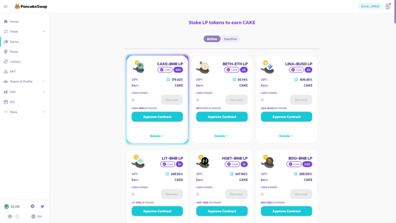
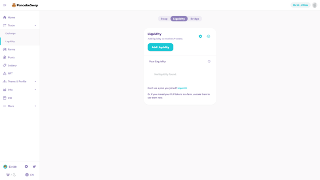
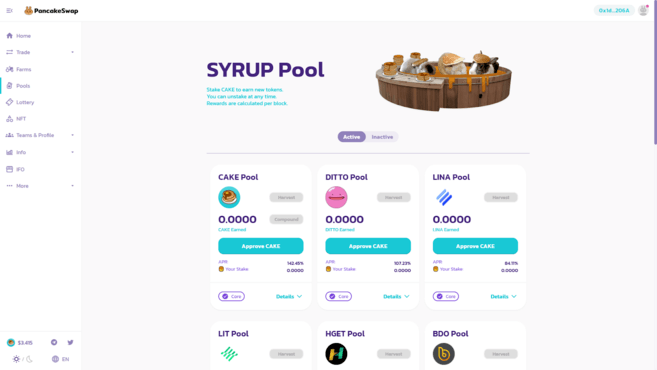
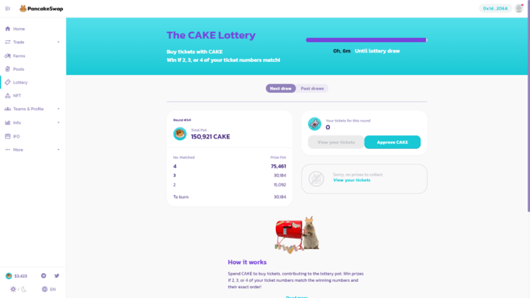
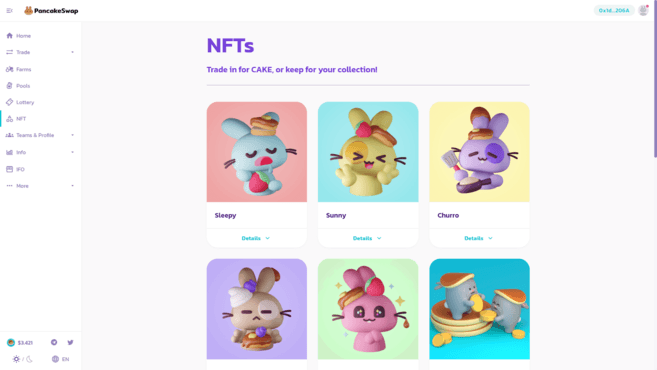

# A Guide to Think in Coin \| Binance Academy

**TL;DR** 

Another food-themed DeFi protocol? You know it. PancakeSwap is a Binance Smart Chain-based DEX launched by anonymous devs with a penchant for breakfast foods and rabbits.

It looks a bit like Ethereum’s [SushiSwap](https://academy.binance.com/en/articles/your-guide-to-sushiswap) \(community governance, the ability to farm liquidity provider tokens\), but also incorporates many other features that let you earn rewards.

The food-based farming craze has captivated participants in the crypto space for months. In the latest wave of DeFi protocols, we’ve seen numerous platforms emerge that allow users to stake their funds in return for the protocol’s tokens.

The bulk of this activity has been concentrated on the [Ethereum](https://academy.binance.com/en/articles/what-is-ethereum) blockchain. As one of the earliest blockchains supporting smart contracts, it has a sprawling community of users, developers, and tools for building powerful decentralized applications.

In this article, we’ll take a look at [PancakeSwap](https://pancakeswap.finance/) – a decentralized exchange built on [Binance Smart Chain \(BSC\)](https://academy.binance.com/en/articles/an-introduction-to-binance-smart-chain-bsc).

PancakeSwap is a decentralized exchange for swapping [BEP-20 tokens](https://academy.binance.com/en/glossary/bep-20).

The PancakeSwap exchange UI.

Familiar with [Uniswap](https://academy.binance.com/en/articles/what-is-uniswap-and-how-does-it-work) or SushiSwap? Then you’ll have no issue grasping PancakeSwap – they are quite similar in their core design.

PancakeSwap uses an [automated market maker \(AMM\)](https://academy.binance.com/en/articles/what-is-an-automated-market-maker-amm) model. That means that while you can trade digital assets on the platform, there isn’t an order book where you’re matched with someone else. Instead, you trade against a [liquidity pool](https://academy.binance.com/en/articles/what-are-liquidity-pools-in-defi).

Those pools are filled with other users’ funds. They deposit them into the pool, receiving liquidity provider \(or LP\) tokens in return. They can use those tokens to reclaim their share, plus a portion of the trading fees. 

So, in short, you can trade BEP-20 tokens, or add liquidity and earn rewards. There are also other features we’ll cover later.

You’ll find these LP tokens in several flavors – if you added, say, BUSD and BNB to the pool, you’ll receive BUSD-BNB LP tokens in return. BETH and ETH? You’ll get BETH-ETH LP tokens.

But wait, there’s more! PancakeSwap also allows you to farm its governance token – CAKE.

Yum.

On the farm, you can deposit your LP tokens, locking them up in a process that rewards you with CAKE. Which LP tokens can you deposit? Well, the list is quite long, but here’s a taster of some of the most popular ones:

* CAKE – BNB LP
* BUSD – BNB LP
* BETH – ETH LP
* USDT – BUSD LP
* USDC – BUSD LP
* DAI – BUSD LP
* LINK – BUSD LP
* TWT – BNB LP

The rewards don’t end here, however! You can earn even more by staking your CAKE in SYRUP pools.

So you’ve deposited some funds to receive LP tokens, and you’ve used them to farm CAKE. From there, you can stake your CAKE and earn other tokens through special staking pools.

The biggest SYRUP pool is simply for CAKE, where you can stake your CAKE to earn even more CAKE! But there are many more tokens you can earn by staking CAKE, so be sure to keep an eye on the [SYRUP pool](https://pancakeswap.finance/pools) page.

You’ll notice if you visit [https://pancakeswap.finance](https://pancakeswap.finance/) that many features are inaccessible until you click on Unlock Wallet. Click on it, and you’ll be met with a few options: MetaMask, Trust Wallet, WalletConnect, Binance Chain Wallet, and other options. 

But wait, we hear you say, isn’t MetaMask an Ethereum wallet?

Yes, it is, but the architecture of Binance Smart Chain is such that you can use MetaMask to interact with BSC-based DApps. If you choose to use MetaMask, we suggest you check out our [Connecting MetaMask with Binance Smart Chain](https://academy.binance.com/en/articles/connecting-metamask-to-binance-smart-chain) guide.

Once you’ve got that set up, you can unlock your wallet to reveal additional information. You’ll see that different LP tokens promise different returns. So how can you add liquidity?

Again, if you’ve used any AMM previously, then you know the drill. To farm CAKE, you need to first add liquidity to the exchange.

Navigate to Trade on the sidebar on the left, then click on Liquidity, hit Add Liquidity, and select the token pair that you want to deposit. Also, make sure you know about [impermanent loss](https://academy.binance.com/en/articles/impermanent-loss-explained) before adding liquidity to a pool.

Adding liquidity to PancakeSwap.

Okay, so you’ve got your LP tokens, now it’s time to stake them to earn CAKE. Navigate to the [Farms](https://pancakeswap.finance/farms) tab, and select the option that matches your LP tokens.

As with ERC-20 tokens, you’ll need to approve the movement of BEP-20 tokens – this is what allows the contract to withdraw them on your behalf. When you click Approve Contract, a popup will ask you to confirm the transaction and display a fee.

Once that transaction confirms, simply select the amount you want to stake and confirm it. You can navigate away from the page and come back at any time to check how much CAKE you’ve earned – if you want to harvest your rewards at any point, click on Harvest and confirm the transaction.

Once you’ve got CAKE, you can stake it in SYRUP pools. Go to the [Pools](https://pancakeswap.finance/pools) tab, and you’ll be presented with the pools where you can stake your CAKE.

SYRUP pools – stake CAKE, earn new tokens.

Once again, you need to approve the withdrawal of your tokens. Hit Approve CAKE to do so. When that has been approved, you’ll need to select the amount of CAKE you want to stake.

Now that the CAKE has been staked, you’ll be earning the reward token of the pool passively. If you’d like to cash out your rewards, click on Harvest.

That’s great, but what else can you do with your CAKE? Well, you can enter a lottery on PancakeSwap.

Try your luck in the PancakeSwap lottery.

Each lottery session takes 6 hours. One ticket costs 10 CAKE, which will give you a random four-digit combination of numbers between 1 and 14, for example, 12-8-4-3. To win the jackpot \(50% of the entire lottery pool\), the numbers in your ticket need to match all four numbers in the same position as the winning ticket.

What if you don’t match all four? No worries. You also win rewards if two or more of your numbers are in the same position as the numbers in the winning ticket.

Wait, so you can do even more with PancakeSwap? Yes, you can win special NFTs.

Win some of the cutest NFTs on BSC.

If you’re chosen as a winner of an NFT, you can trade it for the CAKE value it represents or keep the cutie in your wallet as a collector’s item.

How can you get involved? You need to register for a chance to win, and the winners get chosen at random. Make sure to keep an eye on the [NFT page](https://pancakeswap.finance/nft) for upcoming opportunities.

## Teams & profiles

Looking for more gamification? Teams and profiles are your chance. You can show off your stats by creating a public profile, and join one of the teams to compete for team achievements!

Initial Farm Offerings \(IFO\) are a way to get a newly launched token in the hands of users using the power of [yield farming](https://academy.binance.com/en/articles/what-is-yield-farming-in-decentralized-finance-defi). On PancakeSwap, you can do that by committing LP tokens from a supported pool to get access to the sale of a newly launched token.

You can check the currently active IFOs on PancakeSwap on the [IFO page](https://pancakeswap.finance/ifo).

PancakeSwap has been audited by CertiK.

Does that mean it’s completely safe to use? No. Depositing funds into a smart contract always carries the risk of bugs, even for audited and highly reputable projects. Never deposit more than you can afford to lose.

PancakeSwap is the biggest AMM project on Binance Smart Chain \(BSC\) with some innovative features. You can also track a lot of its metrics on [https://pancakeswap.info/](https://pancakeswap.info/).

Ethereum may have kickstarted the DeFi trend, but initiatives like PancakeSwap suggest that the wave of innovation is destined to spread to other chains.

