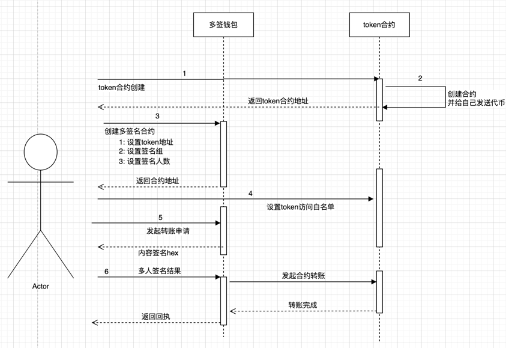
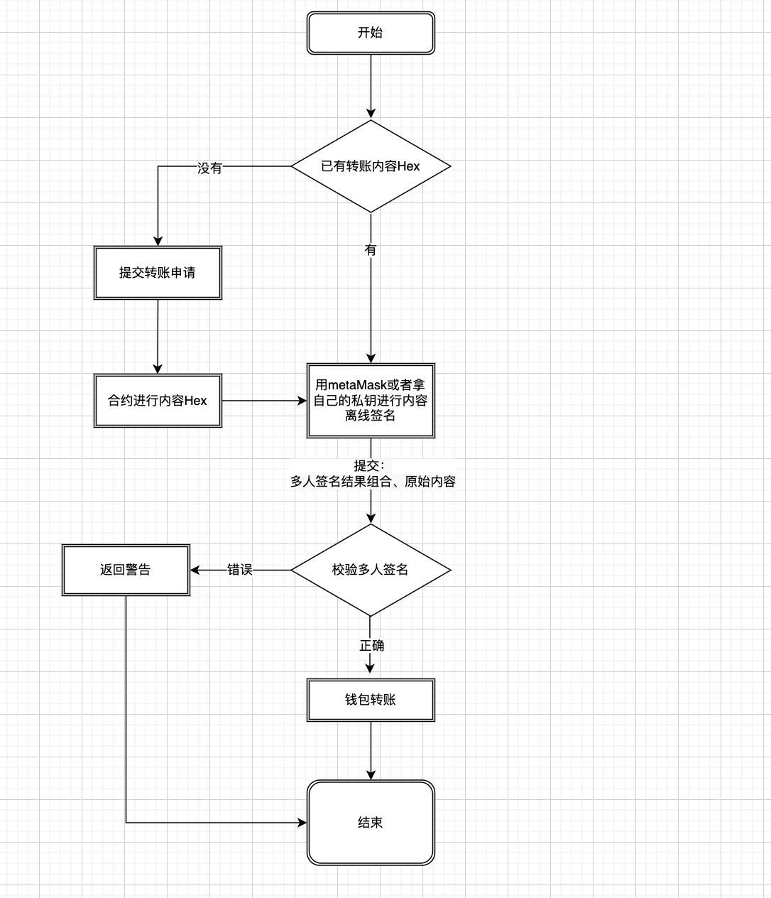
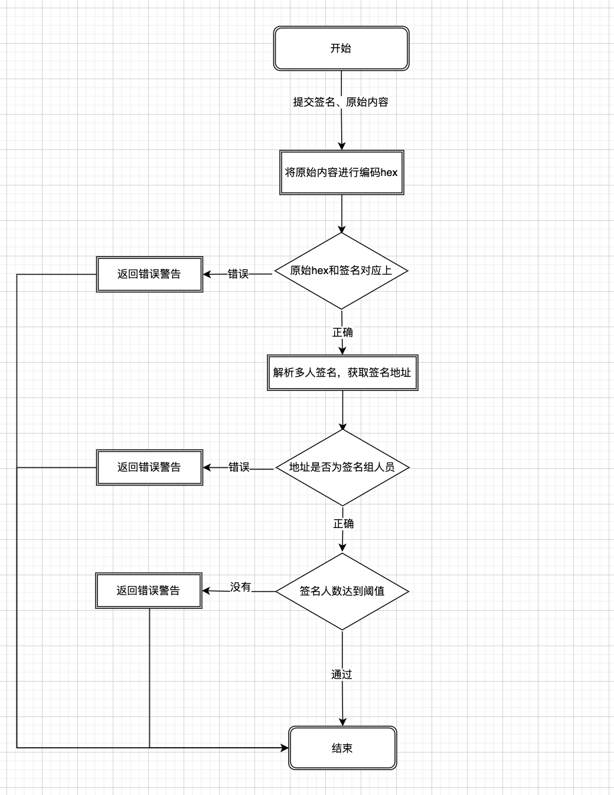
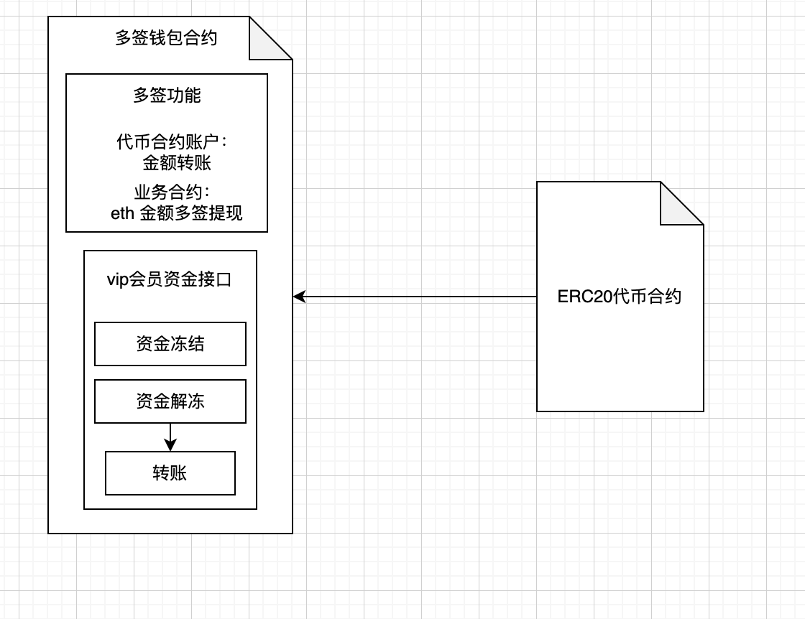

# 多签钱包
### 简介
合约进行内容签名，将一笔交易内容分别交由多个人签名，最后将所有的签名进行打包成一个hash数据进行解析，得到交易的签名人数和交易内容，最后进行人数判断是否符合出账。

优点：无需维护交易信息，只需要进行最后的签名解析认证，gas费用低。

缺点是：需要用户进行离线内容签名和最后进行打包提交，用户操作略微麻烦。

## 文件目录

    ├── LICENSE
    ├── contracts  #包含我们智能合约的 Solidity 源文件。这里有一个重要的契约叫做
        |── ZeroToken.sol 铸币合约
        |── MultiSigWallet.sol 多签合约
    ├── migrations #Truffle 使用迁移系统来处理智能合约部署。迁移是一个额外的特殊智能合约，用于跟踪更改。
    ├── src
    ├── test # 包含我们智能合约的 JavaScript 和 Solidity 测试
    └── truffle-config.js # 配置文件

## 设计思路

1. 设置多签人和门槛（链上）：部署多签合约时，我们需要初始化多签人列表和执行门槛（至少n个多签人签名授权后，交易才能执行）。Gnosis Safe多签钱包支持增加/删除多签人以及改变执行门槛，但在咱们的极简版中不考虑这一功能。

2. 创建交易（链下）：一笔待授权的交易包含以下内容
    - to：目标合约。
    - value：交易发送的以太坊数量。
    - data：calldata，包含调用函数的选择器和参数。
    - tx_type: 交易的类型，erc20 token 交易填0，eth 交易填1
    - nonce：初始为0，随着多签合约每笔成功执行的交易递增的值，可以防止签名重放攻击。
    - chainid：链id，防止不同链的签名重放攻击。

代码如下：
MultiSigWallet.sol
```solidity
    /// @dev 编码交易数据
    /// @param to 目标合约地址
    /// @param value msg.value，支付的以太坊
    /// @param data calldata
    /// @param _nonce 交易的nonce.
    /// @param tx_type 交易的类型.0-erc20代币，1-eth
    /// @param chainid 链id
    /// @return 交易哈希bytes.
    function encodeTransactionData(
        address to,
        uint256 value,
        bytes memory data,
        uint256 _nonce,
        uint256 tx_type,
        uint256 chainid
    ) public pure returns (bytes32) {
        bytes32 safeTxHash = keccak256(abi.encode(to, value, keccak256(data), tx_type, _nonce, chainid));
        return safeTxHash;
    }
```

3. 收集多签签名（链下）：将上一步的交易ABI编码并计算哈希，得到交易哈希，然后让多签人签名，并拼接到一起的到打包签名。

        交易哈希: 0xc1b055cf8e78338db21407b425114a2e258b0318879327945b661bfdea570e66

        多签人A签名: 0xd6a56c718fc16f283512f90e16f2e62f888780a712d15e884e300c51e5b100de2f014ad71bcb6d97946ef0d31346b3b71eb688831abedaf41b33486b416129031c

        多签人B签名: 0x2184f70a17f14426865bda8ebe391508b8e3984d16ce6d90905ae8beae7d75fd435a7e51d837881d820414ebaf0ff16074204c75b33d66928edcf8dd398249861b

        打包签名：
        0xd6a56c718fc16f283512f90e16f2e62f888780a712d15e884e300c51e5b100de2f014ad71bcb6d97946ef0d31346b3b71eb688831abedaf41b33486b416129031c2184f70a17f14426865bda8ebe391508b8e3984d16ce6d90905ae8beae7d75fd435a7e51d837881d820414ebaf0ff16074204c75b33d66928edcf8dd398249861b

4. 调用多签合约的执行函数，验证签名并执行交易（链上）。

上述步骤时序图：
  

多签流程图：
  

验签流程图：
  
## 多签调用erc20

1. 创建erc20代币
ZeroToken.sol
```solidity
contract ERC20ZEROToken is ERC20 {
    event log(address);
    constructor() ERC20("ZERO ERC20 Token", "ZERO") {
        // address(this)合约地址本身发送代币
        _mint(address(this), 10000*10000 * 10 ** 18);
        emit log(address(this));
    }
}
```

2. 调用合约代币

MultiSigWallet.sol
```solidity
 // Token地址，设置为私有变量
 ZeroToken private zeroToken;
 constructor(
        address tokenAddress,
        address[] memory _owners,
        uint256 _threshold
    ) {
        // 设置多签的拥有者
        permConf.admin = msg.sender;
        // 获取所在链的id
        chainId = block.chainid;
        // 调用erc20的合约
        zeroToken = ZeroToken(tokenAddress);
        // 设置多签组和每笔需要签名的人数
        _setupOwners(_owners, _threshold);
    }
```
_setupOwners()：在合约部署时被构造函数调用，初始化owners，isOwner，ownerCount，threshold状态变量。传入的参数中，执行门槛需大于等于1且小于等于多签人数；多签地址不能为0地址且不能重复。

MultiSigWallet.sol
```solidity
    /// @dev 初始化owners, isOwner, ownerCount,threshold
    /// @param _owners: 多签持有人数组
    /// @param _threshold: 多签执行门槛，至少有几个多签人签署了交易
    function _setupOwners(address[] memory _owners, uint256 _threshold)
        internal
    {
        // threshold没被初始化过
        require(signConfig.threshold == 0, "threshold is not init");
        // 多签执行门槛 小于 多签人数
        require(_threshold <= _owners.length, "threshold is too low");
        // 多签执行门槛至少为1
        require(_threshold >= 1, "min threshold is 1");
        for (uint256 i = 0; i < _owners.length; i++) {
            address owner = _owners[i];
            // 多签人不能为0地址\本合约地址\不能重复
            require(owner != address(0) && owner != address(this) &&!signConfig.isOwner[owner],"_owners fail");
            signConfig.owners.push(owner);
            signConfig.isOwner[owner] = true;
        }
        signConfig.ownerCount = _owners.length;
        signConfig.threshold = _threshold;
    }

```

3. ERC20合约设置允许多签钱包操作

ZeroToken.sol
```solidity
    // 权限设置
    // 设置只允许开放的地址操作合约的金额
    modifier onlyWhite() {
        require(permConf.admin == msg.sender || permConf.whiteAddress == msg.sender,"You are not allow");
        _;
    }
    // addr 多签地址
    function setAllowAddress(address addr) public onlyOwner {
        permConf.whiteAddress = addr;
    }
```  

4. 整体架构


