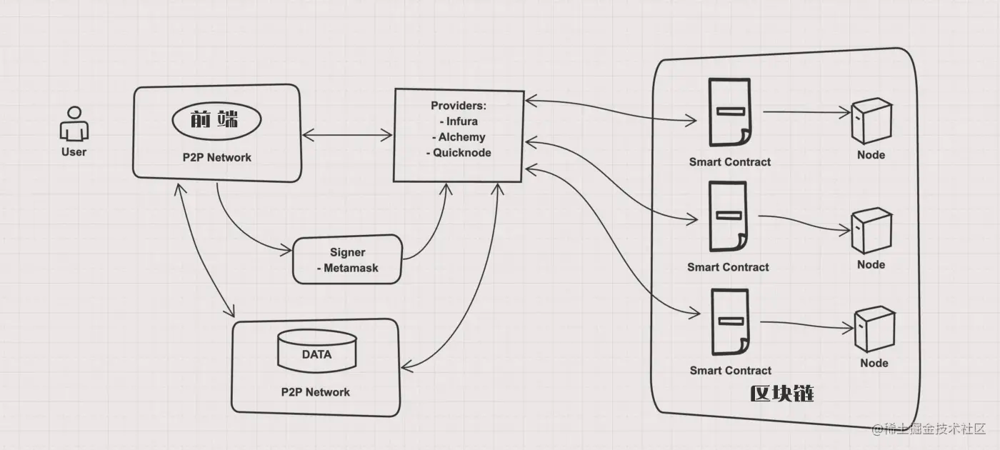
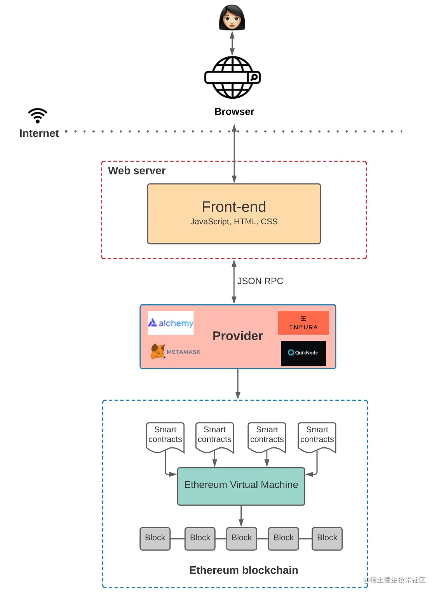
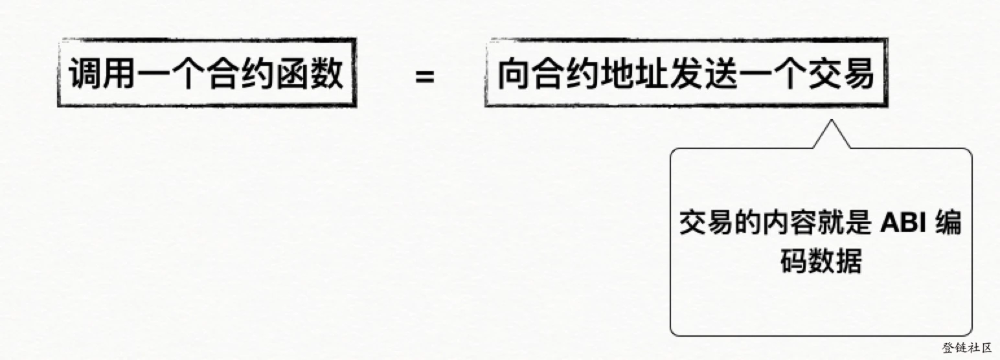
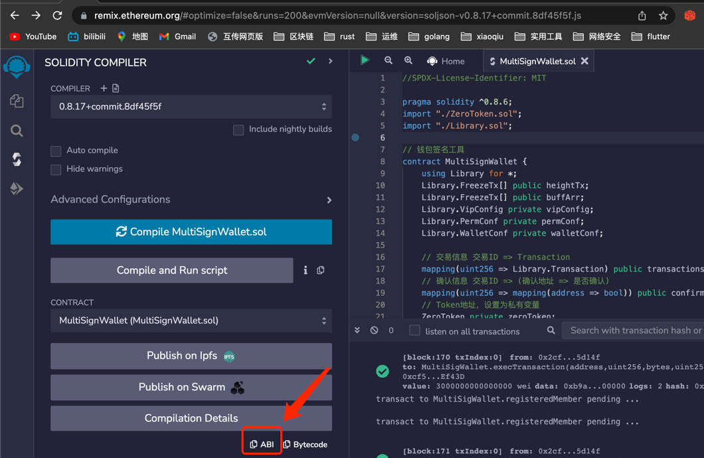
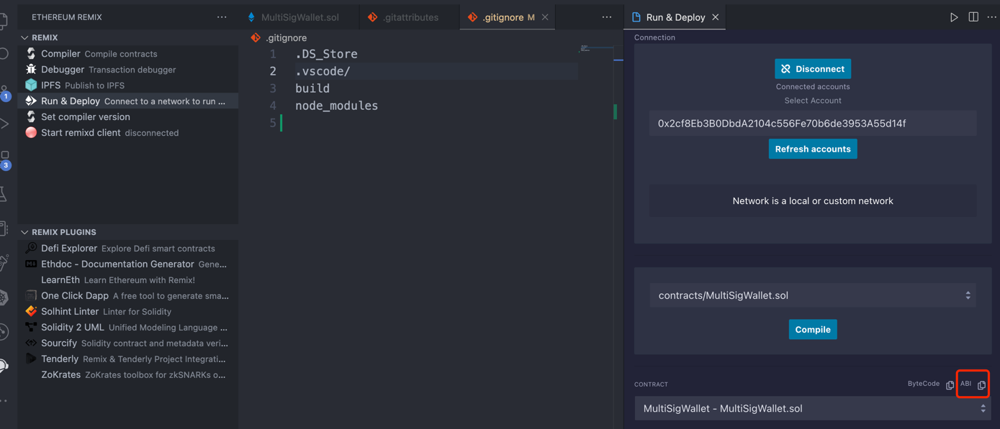
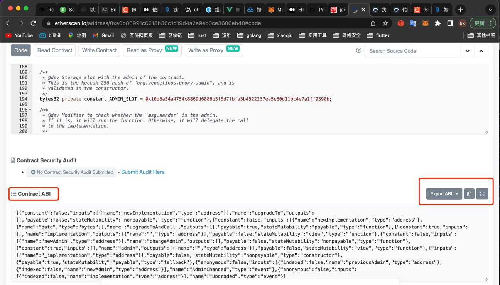

# multiSignWalletVue

## 简介

这个是一个对接以太坊多签钱包合约的demo，调用ethers.js库和合约进行交互

技术栈：

> vue2 ethers.js element-ui

ethers.js 中文文档：

> https://learnblockchain.cn/docs/ethers.js/getting-started.html

eth浏览器地址：
> https://etherscan.io/

## web3架构图






## 目录

    |---build 打包目录
    |---config 配置
    |---src
      |---assets     资源
      |---components  组件（主要的交互界面我放在这）
      |---router      路由
      |---utils       工具
        |---abi         合约的abi
          |---abi.js    abi内容，需要去找合约开发要或者上eth区块浏览器上复制
        |---wallets.js  ethers.js 交互的主要js函数(请对照中文文档去理解)
      |---App.vue       vue界面入口
      |---main.js       全局组件加载
      ...

## src/utils/wallets.js 主要方法说明

- 构建全局实例
```js
  // 提供一个可选的 提供者Provider 参数用于连接节点
  // window.ethereum连接的是你区块浏览器的小狐狸
  let provider = new ethers.providers.Web3Provider(window.ethereum);
  // eth扫描实例
  let etherScanProvider = new ethers.providers.EtherscanProvider();
```
- 判断是否安装了小狐狸钱包

```js
    // 判断小狐狸MetaMask是否安装
    if (window.ethereum) {
        // 启动小狐狸连接页面
        await window.ethereum.enable().then((res) => {
          // 获取连接的钱包的用户地址，默认取第一个地址
          walletAddress = res[0]
          console.log("当前钱包res：" + res);
        });
      } else {
            alert("请安装MetaMask钱包")
      }
```
- 基础用法(获取账号信息、查询区块、查询交易等)请看wallet.js注释，或者看ethers.js官网文档

## abi 和 合约调用说明

- abi是什么？
> ABI 全称是 Application Binary Interface，翻译过来就是：应用程序二进制接口，简单来说就是 以太坊的调用合约时的接口说明。

- 调用合约函数发生了什么?
  从外部施加给以太坊的行为都称之为向以太坊网络提交了一个交易，调用合约函数其实是向合约地址（账户）提交了一个交易，
  这个交易有一个附加数据，这个附加的数据就是ABI的编码数据。 如图所示：
  

- abi 内容如何获取？
  由合约开发者给，如：

  1. remix上获取
  
  2. vscode上获取
  
  3. eth浏览器上获取
  

- src/utils/wallets.js 使用abi调用合约

1. 连接合约
```js
 // contractAddress 合约地址 合约开发者提供，或者在链上获取
 let contractAddress = "0xF7137Bb94A6a00659355d5eB7a67baD32a218C9e"
 // ABI 我预先放在src/utils/abi/abi.js 里
 // provider.getSigner() 可以看上面的初始化连接钱包的实例
 let contract = new ethers.Contract(contractAddress, ABI, provider.getSigner());
```
> 备注：ABI 具体内容可以看src/utils/abi/abi.js

2. 调用合约

假设调用合约上的函数：

```solidity
    // 合约的函数
    function encodeTransactionData(
        address to,
        uint256 value,
        bytes memory data,
        uint256 _nonce,
        uint256 tx_type,
        uint256 chainid
    ) public pure returns (bytes32) {
        bytes32 safeTxHash = keccak256(abi.encode(to, value, keccak256(data), tx_type, _nonce, chainid));
        return safeTxHash;
    }
```

```js
    // 先连接合约
    let contract = new ethers.Contract(contractAddress, ABI, provider.getSigner())
    // 调用合约上的方法
    // encodeTransactionData 是我在合约上写的函数方法。
    // to, value, data, _nonce, tx_type, chainId 是合约上的函数入参，具体请看上面
    let hex = await contract.encodeTransactionData(to, value, data, _nonce, tx_type, chainId)
```
如此合约调用就完成了。


## Build Setup

``` bash
# install dependencies
npm install

# serve with hot reload at localhost:8080
npm run dev

# build for production with minification
npm run build

# build for production and view the bundle analyzer report
npm run build --report

# run unit tests
npm run unit

# run e2e tests
npm run e2e

# run all tests
npm test
```

For a detailed explanation on how things work, check out the [guide](http://vuejs-templates.github.io/webpack/) and [docs for vue-loader](http://vuejs.github.io/vue-loader).
